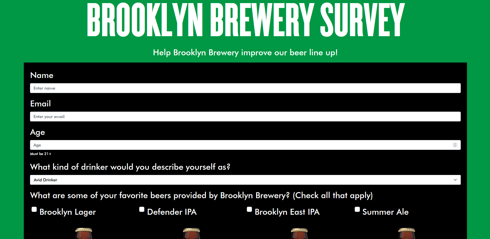
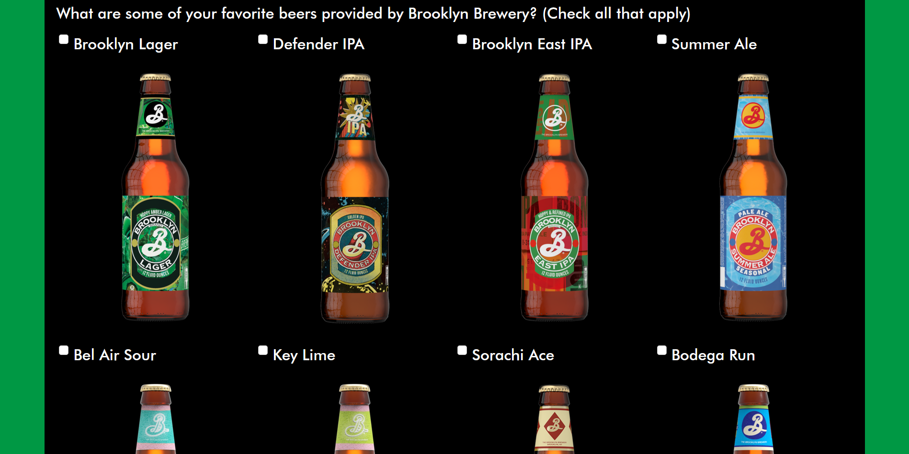
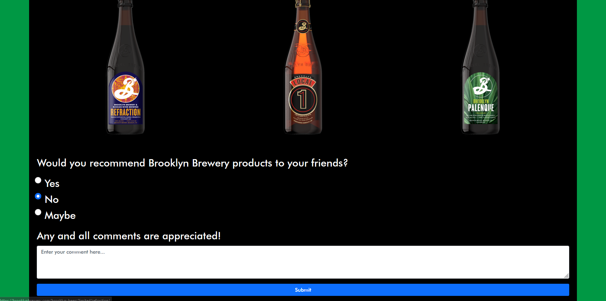
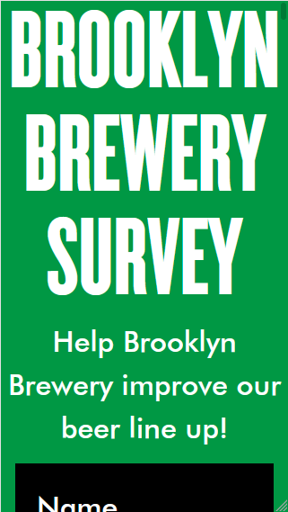
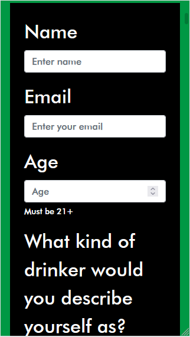
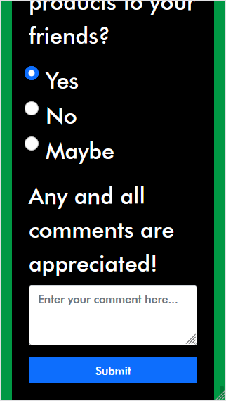

# Survery Form

https://brooklynbrewerysurvey.netlify.app/

A accessible responsive survey form webpage.

## Technologies Used
- HTML5
- CSS3
- SASS
- Bootstrap
## Description
This webpage is an improvement of a previous project that was a part of a series of projects for the completion of the [FreeCodeCamp Responsive Web Design certification](https://www.freecodecamp.org/learn/responsive-web-design/#responsive-web-design-projects). The purpose of this webpage is to get user input via a survey form.
### Goal
For this project I decided to base the survey form on Brooklyn Brewery, a local brewery. Using company assets, I hope to capture the spirit of Brooklyn Brewery.
### Notes
- Bootstrap was used for the design of the webpage
- SASS was used to increase simplicity
- The HTML and CSS code was validated by the [W3C Markup Validation Service](https://validator.w3.org/) to ensure functionality.
- Best practices for accessibility was used for this project, additionally the Firefox [Accessibility Inspector](https://developer.mozilla.org/en-US/docs/Tools/Accessibility_inspector) and the [WAVE Web Accessibility Evaluation Tool](https://wave.webaim.org/) was also used to ensure accessibility.
- In addition to responsiveness for large screens, responsiveness was also provided for smaller screens like smartphones with the use of the Bootstrap framework.
- Deployed using Netlify
## Links
- FreeCodeCamp's Responsive Web Design [certification curriculum](https://www.freecodecamp.org/learn/responsive-web-design/#responsive-web-design-projects)
- FreeCodeCamp's Build a Survey Form [Project details](https://www.freecodecamp.org/learn/responsive-web-design/responsive-web-design-projects/build-a-survey-form)
- [W3C Markup Validation Service](https://validator.w3.org/)
- [WAVE Web Accessibility Evaluation Tool](https://wave.webaim.org/)